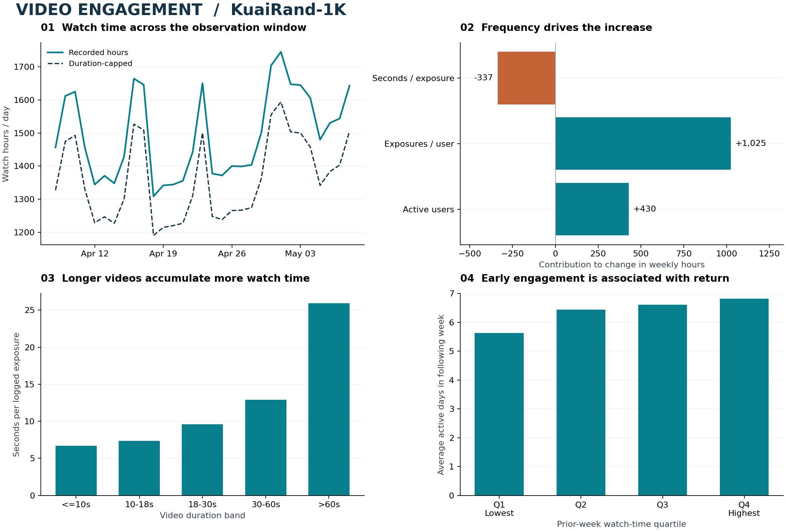

# Video Engagement Analytics

**Why did watch time increase, and what does viewing behavior tell us about audience return?**

An independent portfolio project using real **KuaiRand-1K** short-video logs. SQL builds event, daily and user-day marts; Python decomposes engagement changes, validates denominators and generates an interactive HTML report. This is observational product analytics, not a deployed business intervention.



## Findings

- Watch time increased 10.95% between the two complete comparison weeks. Exposure frequency contributed +1,025 hours, while seconds per exposure contributed -337 hours. More activity did not mean deeper viewing per exposure.
- Mean seconds per exposure fell 0.489 seconds. The duration-mix component was -0.335 seconds and the within-band component was -0.154 seconds. This is an arithmetic decomposition, not causal attribution.
- The highest prior-week watch-time quartile averaged 6.82 active days in the next week, versus 5.63 in the lowest quartile. Both groups had high next-week return; active-day intensity is more informative here than a binary returned/not-returned label.
- Exact-day D7 return was 93.37% (929/995 eligible users). First-observed cohorts in this selected sample are not signup cohorts, and nonreturn is not confirmed churn.

## What I built

- A checksum-verified ingestion pipeline for **11,756,073 events**, with exact duplicate auditing, domain checks and explicitly defined exposure populations.
- DuckDB SQL marts for daily KPIs, video-duration segments, recommendation scenarios, censored D1/D7 return and temporally separated audience segments.
- An exact three-factor Shapley decomposition of watch hours and a duration-mix versus within-band decomposition of average viewing time, both reconciled to observed changes.
- A stakeholder report with an interactive daily metric selector, aggregate CSVs, an executed companion notebook, and tests for censoring, replay, thresholds, join cardinality and arithmetic reconciliation.

## Reproduce

Python 3.12 and `curl` are required. The official archive is 1.14 GB; allow about 5 GB of free disk space for the archive, extracted logs and DuckDB working files. The local run uses four DuckDB threads and a 2 GB memory limit. No API credentials or paid services are needed.

```bash
python -m venv .venv
# Windows PowerShell: .venv\Scripts\Activate.ps1
# macOS/Linux: source .venv/bin/activate
python -m pip install -r requirements.txt
python scripts/fetch_data.py
python scripts/analyze.py
python scripts/render_report.py
python -m unittest discover -s tests -v
python scripts/verify_artifacts.py
```

Open `reports/index.html` in a browser. To inspect only the published report, downloading the dataset is unnecessary. To query the local marts, open `data/processed/engagement.duckdb` with DuckDB. Raw and user-level data stays git-ignored.

## Evidence and quality

| Check | Result |
|---|---:|
| Official source rows | 11,756,073 |
| Exact duplicate rows removed | 94,225 |
| Zero-duration records excluded from duration-based primary metrics | 936,226 |
| Eligible standard-policy exposures | 10,683,905 |
| Sampled users represented | 1,000 |
| Formula / recorded long-view mismatches, all valid policies | 55,975 |
| Source-date / UTC+8 disagreements, all valid policies | 75,566 |
| Data reconciliation checks | 12, all passed |

The unknown-duration records contain 1,567.7 standard-policy watch hours. Their impact is visible in [watch sensitivity](reports/watch_sensitivity.csv). Recorded watch hours, duration-capped watch hours and the explicit long-view proxy answer different questions. No global CTR is reported because the source `is_click` semantics vary by interface. Source calendar dates are retained; date disagreements and feedback-label discrepancies remain upstream uncertainties.

## Read the work

| Artifact | Purpose |
|---|---|
| [Metric contracts](docs/metric_contracts.md) | Grain, windows, numerators, denominators and boundaries |
| [Cleaning SQL](sql/01_clean.sql) | Exact deduplication, validity rules, replay treatment |
| [Analytical SQL](sql/02_marts.sql) | KPIs, content segments, returns and audience features |
| [Analysis notebook](notebooks/engagement_analysis.ipynb) | Executed walkthrough of published results and methods |
| [Results and checks](reports/results.json) | Machine-readable outputs, exclusions and validations |
| [Data provenance](reports/data_provenance.json) | Official source, archive MD5 and extracted-file SHA-256 |

## Interpretation limits

The source covers 1,000 sampled Kuaishou users during a 2022 observation window. First observation is not signup, and absent activity is not proven churn. This is not Disney customer data, a subscription experiment or evidence of increased revenue. Quartile comparisons are associations with no causal interpretation. Full-month statistical features are not used as predictors because they can leak future outcomes. Duration bands describe length, not genre. Arithmetic contributions explain the observed KPI difference; they are not estimates of treatment effects.

## Source and license

[KuaiRand](https://kuairand.com/), Gao et al., CIKM 2022, [DOI 10.1145/3511808.3557624](https://doi.org/10.1145/3511808.3557624). The official [Zenodo archive](https://zenodo.org/records/10439422) is downloaded and verified locally. Original code: MIT. Data-derived reports and figures: CC BY-SA 4.0; see [DATA_LICENSE.md](DATA_LICENSE.md).
